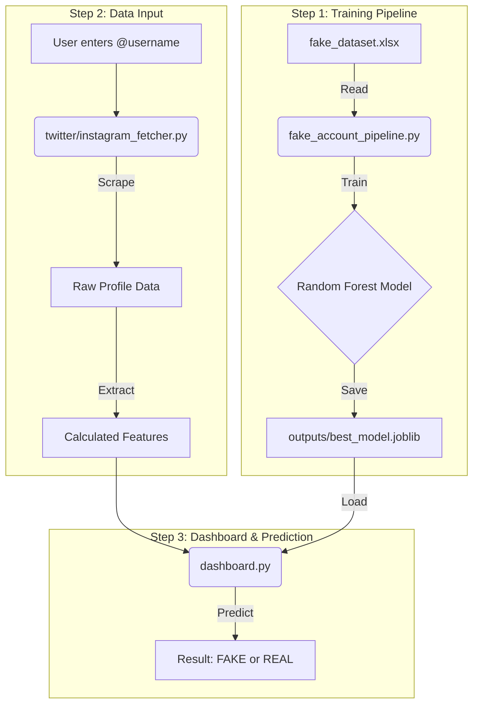

# Fake Social Media Account Detection System

<div align="center">


</div>

A machine learning system that detects fake accounts on Twitter/X and Instagram by analyzing profile behavior, engagement patterns, and metadata. Simply enter a username, and get instant predictions with confidence scores.

**🌐 [Try it Live](https://fake-social-media-account-detector-hv3j4nrdtnwrgwhrnk7zyl.streamlit.app/)** - No installation required

## 🔄 How It Works



**What happens behind the scenes:**
1. Train once on labeled data → Save model
2. User inputs username → Fetch profile metrics  
3. Extract features → Run prediction → Show results

## 📋 Prerequisites

- Python 3.8 or higher
- pip package manager
- Active internet connection (for profile fetching)

## 🚀 Quick Start

### Installation
```bash
# Clone and setup
git clone https://github.com/Deekshith06/fake-social-media-detection.git
cd fake-social-media-detection

# Create virtual environment
python -m venv venv
source venv/bin/activate  # On Windows: venv\Scripts\activate

# Install dependencies
pip install -r requirements.txt
```

### Usage
```bash
# 1. Train the model (first time only)
python fake_account_pipeline.py

# 2. Run the dashboard
streamlit run dashboard.py
```

Access the app at `http://localhost:8501`

## 📂 Project Structure

```
├── fake_account_pipeline.py    # Model training
├── dashboard.py                 # Web interface
├── twitter_fetcher.py          # Twitter scraper
├── instagram_fetcher.py        # Instagram scraper
├── fake_dataset.xlsx           # Training data
└── outputs/best_model.joblib   # Saved model
```

## 📊 Dataset Format

Your `fake_dataset.xlsx` should include:

| Feature | Description | Example |
|---------|-------------|---------|
| followers_count | Number of followers | 1250 |
| following_count | Accounts followed | 345 |
| posts_count | Total posts | 89 |
| engagement_rate | Avg likes/comments per post | 0.03 |
| verified | Verified badge (1/0) | 0 |
| fake_label | Target: Fake=1, Real=0 | 0 |

## 🔧 Configuration

**API Keys:** Create `.env` for Twitter/X access
```env
TWITTER_API_KEY=your_key
TWITTER_API_SECRET=your_secret
```

**Model Tuning:** Adjust parameters in `fake_account_pipeline.py`
```python
RandomForestClassifier(n_estimators=100, max_depth=20)
```

## 🛠️ Troubleshooting

| Issue | Solution |
|-------|----------|
| Model not found | Run `python fake_account_pipeline.py` first |
| Profile fetch fails | Check username spelling & internet connection |
| Import errors | Reinstall: `pip install -r requirements.txt` |

## 📈 Model Performance

Training displays: Accuracy, Precision, Recall, F1-Score, Confusion Matrix

## 👤 Author

**Seelaboyina Deekshith** - AI/ML Engineer

[](https://www.linkedin.com/in/deekshith030206)
[](https://github.com/Deekshith06)
[](mailto:seelaboyinadeekshith@gmail.com)
[](https://instagram.com/deekshith06)
[](https://twitter.com/deekshith06)

Questions or collaboration? [Open an issue](https://github.com/Deekshith06/fake-social-media-detection/issues) or reach out directly.

---

<div align="center">

⭐ **Star this repo if it helped you!**

Building safer social media with AI 🤖

</div>
